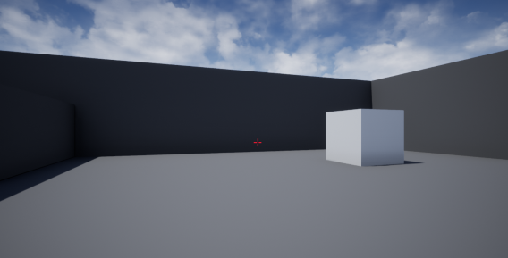
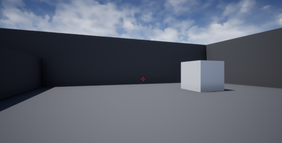

# Demo Game:
Below are images taken while playing the demo game and generating Semantic-XR at the same time (a few very minor adjustments to the documents were done after the generation of the Semantic-XR in order to align it with the latest format structure but the content of the Semantic-XR documents was kept intact).

## 1. Game beginning: a single large cube on the floor with a surrounding wall and cloudy sky.
  * Image

      
  * Semantic-XR (includes instructions, pointsOfCollisionPrediction and id sections)

        {
            "semanticXr":{
                
                "instructions":{
                    "reality":"This is a 3D interactive story application. Use the keys W, A, S and D to move and Left and Right arrows to turn. Press Z to generate Semantic XR.",
                    "scene":"You should reach the destination block (visually indicated blue) while avoiding the other blocks (visually indicated grey).",
                    "frame":" block: right near"
                },
            
                "pointsOfCollisionPrediction": [
			        {
                        "collisionsPredictions":[
                            {"directionName": "forward", "name":"obstacle"}
                        ]
                    }
                ],

                "id":{
                    "realityId":"SemanticXrAccessibilityProofOfConcept",
                    "realityInstanceId":"SemanticXrAccessibilityProofOfConcept2BB675B24CD2D1D3AEB1EDAF03CD68A0",
                    "realityInstanceTimestamp":8.94441
                }
            }
        }

## 2. Game beginning: same scene but with different amount of details in the Semantic-XR.
  * Image

      
  * Semantic-XR (relative to previous Semantic-XR, semanticSpatialEntities section was added with one cube and a collision prediction distance field was added)

        {
            "semanticXr":{

                "instructions":{
                    "reality":"This is a 3D interactive story application. Use the keys W, A, S and D to move and Left and Right arrows to turn. Press Z to generate Semantic XR.",
                    "scene":"You should reach the destination block (visually indicated blue) while avoiding the other blocks (visually indicated grey).",
                    "frame":" block: right near"
                },
                
                "semanticSpatialEntities":[
                        {"semanticSpatialEntityId":"EditorCube8","name":"block","physical":{"location":{ "x":1073, "y":539, "z":113}}}],
                
                "pointsOfCollisionPrediction": [
			        {
                        "collisionsPredictions":[
                            {"directionName": "forward", "name":"obstacle", "distance":1701}
                        ]
                    }
                ],

                "id":{
                    "realityId":"SemanticXrAccessibilityProofOfConcept",
                    "realityInstanceId":"SemanticXrAccessibilityProofOfConcept2BB675B24CD2D1D3AEB1EDAF03CD68A0",
                    "realityInstanceTimestamp":21.121567
                }
            }
        }

## 3. After stepping backwards a few steps. Two cubes are in the field of view.
  * Image

      
  * Semantic-XR (another cube was added to semanticSpatialEntities section)

        {
            "semanticXr":{

                "instructions":{
                    "reality":"This is a 3D interactive story application. Use the keys W, A, S and D to move and Left and Right arrows to turn. Press Z to generate Semantic XR.",
                    "scene":"You should reach the destination block (visually indicated blue) while avoiding the other blocks (visually indicated grey).",
                    "frame":" block: right far,  block: rightmost far"
                },

                "semanticSpatialEntities":[
                        {"semanticSpatialEntityId":"EditorCube8","name":"block","physical":{"location":{ "x":1588, "y":539, "z":186}}},
                        {"semanticSpatialEntityId":"EditorCube9","name":"block","physical":{"location":{ "x":1329, "y":1297, "z":99}}}],

                "pointsOfCollisionPrediction": [
			        {
                        "collisionsPredictions":[
                            {"directionName": "forward", "name":"obstacle", "distance":2221}
                        ]
                    }
                ],
                
                "id":{
                    "realityId":"SemanticXrAccessibilityProofOfConcept",
                    "realityInstanceId":"SemanticXrAccessibilityProofOfConcept2BB675B24CD2D1D3AEB1EDAF03CD68A0",
                    "realityInstanceTimestamp":35.679417
                }
            }
        }

## 4. After turning to the right. Six cubes are in the field of view. Right in the center is the destination blue cube.
  * Image

      
  * Semantic-XR (now there are six cubes in the semanticSpatialEntities section and collision prediction points to the destination)

        {
            "semanticXr":{

                "instructions":{
                    "reality":"This is a 3D interactive story application. Use the keys W, A, S and D to move and Left and Right arrows to turn. Press Z to generate Semantic XR.",
                    "scene":"You should reach the destination block (visually indicated blue) while avoiding the other blocks (visually indicated grey).",
                    "frame":" block: farleft far,  block: left-ish far,  destination:center near,  block: farright far,  block: farright far,  block: farright far"
                },

                "semanticSpatialEntities":[
                        {"semanticSpatialEntityId":"EditorCube11","name":"destination","physical":{"location":{ "x":1028, "y":8, "z":56}}},
                        {"semanticSpatialEntityId":"EditorCube8","name":"block","physical":{"location":{ "x":1325, "y":-1072, "z":149}}},
                        {"semanticSpatialEntityId":"EditorCube9","name":"block","physical":{"location":{ "x":1775, "y":-403, "z":161}}},
                        {"semanticSpatialEntityId":"EditorCube12","name":"block","physical":{"location":{ "x":1235, "y":866, "z":86}}},
                        {"semanticSpatialEntityId":"EditorCube13","name":"block","physical":{"location":{ "x":1192, "y":1021, "z":79}}},
                        {"semanticSpatialEntityId":"EditorCube14","name":"block","physical":{"location":{ "x":1195, "y":939, "z":231}}}],

                "pointsOfCollisionPrediction": [
			        {
                        "collisionsPredictions":[
                            {"directionName": "forward", "name":"destination", "distance":1019, "semanticSpatialEntityId":"EditorCube11"}
                        ]
                    }
                ],

                "id":{
                    "realityId":"SemanticXrAccessibilityProofOfConcept",
                    "realityInstanceId":"SemanticXrAccessibilityProofOfConcept2BB675B24CD2D1D3AEB1EDAF03CD68A0",
                    "realityInstanceTimestamp":47.157001
                }
            }
        }

## 5. After moving forward and getting closer to the destination cube. Only two cubes are in the field of view.
  * Image

      
  * Semantic-XR (now there are only two cubes in the semanticSpatialEntities section, one of them is the destination and collisionPrediction points to the destination which is less distant now)
        
        {
            "semanticXr":{

                "instructions":{
                    "reality":"This is a 3D interactive story application. Use the keys W, A, S and D to move and Left and Right arrows to turn. Press Z to generate Semantic XR.",
                    "scene":"You should reach the destination block (visually indicated blue) while avoiding the other blocks (visually indicated grey).",
                    "frame":" block: left near,  destination:center near"
                },

                "semanticSpatialEntities":[
                        {"semanticSpatialEntityId":"EditorCube11","name":"destination","physical":{"location":{ "x":337, "y":8, "z":-41}}},
                        {"semanticSpatialEntityId":"EditorCube9","name":"block","physical":{"location":{ "x":1083, "y":-403, "z":64}}}],

                "pointsOfCollisionPrediction": [
			        {
                        "collisionsPredictions":[
                            {"directionName": "forward", "name":"destination", "distance":321, "semanticSpatialEntityId":"EditorCube11"}
                        ]
                    }
                ],

                "id":{
                    "realityId":"SemanticXrAccessibilityProofOfConcept",
                    "realityInstanceId":"SemanticXrAccessibilityProofOfConcept2BB675B24CD2D1D3AEB1EDAF03CD68A0",
                    "realityInstanceTimestamp":66.270203
                }
            }
        }

## 6. After moving forward and bumping into the destination cube, a 'You Won!' text is shown.
  * Image

      