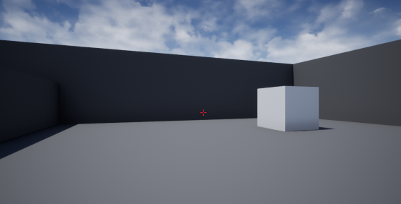

# Introduction
This repository describes an accessibility-focused semantic 3D scene description format: a description of an XR experience as meaningful and well-defined data in order to make it more accessible.

# Motivation and Opportunities
With the growing interest in 3D content, XR experiences and the Metaverse we should not leave anyone behind and enable any person who is interested in it to meaningfully participate in existing and future virtual worlds. The focus of the described format is to make XR experiences more accessible for people with disabilities.  
  
This **semantic** format is still experimental but has the potential to open up many opportunities: first, it **unifies all types of 3D realities and content** (like 3D games and virtual worlds, VR, MR, AR, the real world, videos, TV, films, real-time animation, pictures, sketches etc.). Second, it provides **a way to connect between these different realities**. Third, it enables 3rd-party XR assistive technology creators to **build accessibility solutions in a relatively decoupled way**, without requiring a very deep knowledge of the media internals. Fourth, these accessibility solutions could enable a high degree of **personalization** for their users which is highly desired. The fifth advantage of this format is based on preliminary work of implementing a game engine-based generator for parts of this format. It looks like that content creators would be able to expose this semantic format with contents of their choosing **without a huge effort**, leveraging the power of their 3D authoring tools (like game engines) and using 3rd-party or even native support for Semantic-XR generation that would hopefully be implemeneted. Additional advantages include the ability to **search and query within XR experiences** and support for **"virtual" entities** that do not exist as explicit distinct 3D shapes (like: "Group of flowers" or "Flock of birds"). **Tracking of changes over time** can also be supported by comparing subsequent Semantic-XR documents for differences ("A new car appeared", "A person moved further away" etc.). And finally, the **format is extensible** to support different kinds of entities with their various attributes.  
Please note that this is still an **experimental technology in research phase** and comes with its many challenges (there is a dedicated Challenges section below).
  
# Format
The format itself is described in the file [semanticXr.json](semanticXr.json) which is a JSON file that serves as a template.

# Examples
## Example Image with a Semantic-XR Representation
### Image

  

### Image's Semantic-XR

        {
            "semanticXr":{

                "instructions":{
                    "reality":"This is a 3D interactive story application. Use the keys W, A, S and D to move and Left and Right arrows to turn. Press Z to generate Semantic XR.",
                    "scene":"You should reach the destination block (visually indicated blue) while avoiding the other blocks (visually indicated grey).",
                    "frame":" block: right near"
                },
                
                "semanticSpatialEntities":[
                        {"semanticSpatialEntityId":"EditorCube8","name":"block","physical":{"location":{ "x":1073, "y":539, "z":113}}}],
                
                "collisionDetection":[
                        {"directionName": "forward", "name":"obstacle", "distance":1701}
                ],
                
                "id":{
                    "realityId":"SemanticXrAccessibilityProofOfConcept",
                    "realityInstanceId":"SemanticXrAccessibilityProofOfConcept2BB675B24CD2D1D3AEB1EDAF03CD68A0",
                    "realityInstanceTimestamp":21.121567
                }
            }
        }

## More Examples
There are many other usage examples provided. Like an example that [describes the semantic contents of scenes from a demo 3D interactive environment](Examples/DemoGameCubes/DemoGameCubesREADME.md) (it is based on [my blog post about Making 3D Content More Accessible on the Web: "Semantic XR" Proof of Concept](http://accessiblerealities.com/blog/making-3d-content-more-accessible-on-the-web-semantic-xr-proof-of-concept/)).   
There are also [other examples and links to related videos](Examples/semanticXrExamples.md).  
# Format Instructions
Explanations for the format's fields can be found in [semanticXrInstructions.md](semanticXrInstructions.md).

# About
This repository is part of my social impact project (not a company) named [Accessible Realities](http://accessiblerealities.com/blog/about/) which aims to enable making video games, virtual worlds and XR experiences in general more accessible for people with disabilities focused on people who are blind or have low vision.  
The roots of this work are in a blog post I wrote in 2010 about semantic representation and editing of media and its potential uses: [SEED: Semantic Editing, Encoding and Decoding](http://blog.techscouter.net/techscouter/seed-semantic-editing-encoding-and-decoding), a reference implementation of that idea and additional posts in that [blog](http://blog.techscouter.net/); in research as part of [my social impact project Accessible Realities](http://accessiblerealities.com/blog/about/) since 2017 and in a presentation I gave at the [W3C Workshop on Inclusive Design for Immersive Web standards](https://www.w3.org/2019/08/inclusive-xr-workshop/agenda.html) in 2019. A presentation titled: 'Enabling XR Accessibility with Semantic XR Data Model'.  
I Hope you find this format useful.  
Zohar Gan

# About this repository

## This repository is:
* Focused on **accessibility** purposes.
* Includes a **semantic** format which is a description of an XR experience as meaningful and well-defined data in order to make it more accessible. For example, it includes names and locations of objects which can be communicated in various ways according to user preferences.
* Could enable **personalization of accessibility support**. For example, enabling description of the 3D locations of the objects in multiple ways and enabling the user to choose their preferred method of making things accessible.
* **Designed for content creators** to expose the semantics of their media in order to make it accessible. Content creators like VR collaboration platforms' creators; AR/VR training and educational material producers; 3D game developers; video, animation and film studios (via game engine based virtual production) etc.
* Could **unify all types of 3D realities and content**: 3D games and virtual worlds, AR, MR, VR, the real world, videos, TV, films, pictures, real-time animations, sketches (and who knows, maybe even imagination and dreams in the future...). For example, names and locations of objects are common to all these realities, in addition to many more optional reality characteristics specified in the format.
* Could provide **a way to interconnect between different realities**, different XR experiences, virtual worlds or parts of the Metaverse. Doing this in a human and machine readable way. See the format’s tag ***crossSemanticXrEquality*** for details on linking separate realities and their entities in terms of identity, space and time.
* Could enable **3rd party XR assistive technology creators** to provide support based on the agreed upon semantics of the XR experience if this is specified in such format without relying on the internals of the media. This would potentially, if implemented, allow augmenting the XR experience using screen readers (and their plugins), braille displays, browsers (and their extensions), dedicated software and even operating systems. This is of course dependent on these 3rd party creators' future adoption and support of such semantic format. One of the great challenges here would be how to verify the source of the semantic content (see challenges section below for details).
* The semantic contents could be associated as **metadata** to 3D (and 2D) media including to 3D media streams.
* The format, specified as a **JSON template**, could be implemented in other ways as well like text-based YAML or in binary formats or to fit a game engine-supported/efficient/useful file formats like specific image formats or data structures other than JSON.

## This repository is not:
* The format is **not tied to a specific technology** but is intended to be generic.
* This repository’s **scope is not to maintain a standard**. It might be used as a starting point of a standard after additional research, testing and solving of potential challenges.
* The main focus is **on semantic representation, not on physical representation** like lights, objects' geometry and textures etc.
* The blueprint for how to build a generic generator for the semantic format is **based on game engines’ capabilities** and as-such on the XR experience creator control over what is being exposed to end users.
* Initially, the focus is on trying to accommodate accessibility requirements for people who are blind or have low vision and some support for people who are deaf or hard of hearing and some support for cognitive disabilities’ requirements (like on demand instructions and scene descriptions). **It could be extended to better support these disabilities and to support other disabilities as well**.
* **Navigation** is not explicitly supported by this format but one could add navigation props using the existing mechanisms which will be exposed as semantic spatial entities (signs that describe the area around them, landmarks that can serve as beacons, road signs that point the way, scene descriptions etc.).
* This repository is **not accepting contributions at the moment**, it describes the semantic format as-is at this point in time.

# Challenges
This is still a **work in progress technology** and comes with several challenges and as such also potential challenges that are yet to be identified.
## Example challenges and potential solutions
* Impact of generating the semantic data on **performance**.
  * But this potential issue could be mitigated by measures such as...
    * Support for only high semantic level of detail (only higher level objects by default, not all).
    * Using a schemaVersion with a more limited scope.
    * Lower spatial resolution (for example for images).
    * Lower temporal resolution (frequency of updates).
    * Use more capable and powerful hardware.
* Potential **abuse in competitive games**.
  * But...
    * A lot of non competitive use cases of XR exist. For example, education, social VR, training, entertainment, healthcare, fitness, meditation, data visualization, enterprise, non-competitive games etc. There are also a lot of use cases for generic 3D/4D media like videos, movies, TV, animation, 3D modeling, CAD (Computer-Aided Design) and much more…
    * Another important use case is using Semantic-XR based Accessibility Solutions within a game engine or an editor software during the authoring stage of XR Experiences (even competitive games) and other 3D/4D media. This would be an inclusive solution to enable people with disabilities to participate in the authoring of such content.
    * Creative Mode or Tutorial Mode in competitive games could still benefit from externalizing Semantic-XR and leveraging existing Accessibility Solutions.
    * Slightly changing the exported Semantic-XR data like only approximations of locations etc.
    * Partial sharing of data using a schemaVersion with a limited scope to avoid competitive advantages.
    * Internal-use only of generated Semantic-XR by the creator can be done without export at all of Semantic-XR data. This could be achieved using one-off Accessibility Solutions tailored for the specific experience or using internal reusable plugins (from the creator’s studio) or 3rd party reusable plugins (from the open source community or from marketplaces).
    * Existing measures of battling abuse.
* **People with disabilities participation**.
  * But...
    * Frequent, early and thorough testing and participation in solution design by people with disabilities.
* **Creators of XR Experiences and Accessibility Solution providers and Assistive Technology makers including developers with disabilities participation.**
  * But...
    * Frequent, early and thorough participation in designing and testing the solution by content creators and accessibility solution providers including people with disabilities.
* Potential **security** issues for consumers of semantic data from unverified sources. 
  * But...
    * Further research into using digital signatures and checksums might be useful to enable verification of the source and integrity of the Semantic-XR data. 
* Potential **privacy** issues (for example if players' details are provided as part of the semantic data without consent and\ or in violation of privacy regulations).
  * But...
    * Transparency.
    * Opt-in consent.
    * Partial sharing of data using a schemaVersion with a limited scope and\ or using filters of private data.
* There are **accessibility categories that would be difficult to support** by relying only on the semantic format. For example: content related (such as puzzle hints) and deep modifications (such as avoiding shaky camera movements).
  * But...
    * Not all accessibility challenges can be addressed by Semantic-XR based solutions.
* Wide agreement on common guiding principles, the format itself, the schemaVersions etc.
  * But…
    * Large group effort.
    * Formal standardization by a standards organization.

# Tags-based approach for how to implement a semantic generator
Included is a [tags-based approach on how to implement a generator library for this format](Implementation/semanticXrTagsBasedApproach.md) that leverages game engine capabilities for its purpose. It includes a list of the tags that are needed to generate Semantic-XR based on game engine capabilities.